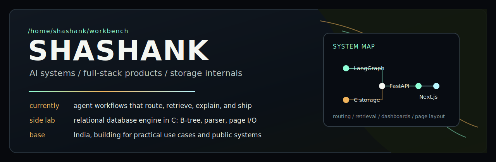

<p align="center">
  
</p>

<p align="center">
  <a href="https://linkedin.com/in/shashank3162">LinkedIn</a>
  /
  <a href="mailto:shashankgowda3182@gmail.com">Email</a>
  /
  <a href="https://govbot-fawn.vercel.app">GovBot live</a>
  /
  <a href="https://github.com/shashank03-dev/MotionCode">MotionCode repo</a>
</p>

## Builder Profile

I build AI systems that survive contact with real users: agent graphs, RAG pipelines, WhatsApp flows, FastAPI backends, and dashboards that make the system observable. I also like the lower layers, especially databases, storage engines, memory, parsers, and C.

```txt
location: India
focus: agentic systems, full-stack AI products, storage internals
now: LangGraph systems for practical workflows
learning: NVIDIA deep learning, multi-agent design, database internals
open_to: collaborations, product builds, difficult engineering problems
```

## Lead Builds

<table>
  <tr>
    <td width="50%" valign="top">
      <h3>GovBot</h3>
      <p><b>WhatsApp-first AI for Indian government services.</b></p>
      <p>Citizens ask in plain text. A LangGraph agent routes intent, retrieves from scraped government documents, and returns a usable answer. The system includes a Next.js operator dashboard for sessions and knowledge-base work.</p>
      <p>
        <a href="https://govbot-fawn.vercel.app">Live</a>
        /
        <a href="https://github.com/shashank03-dev/GovBot">Repository</a>
      </p>
      <p><code>LangGraph</code> <code>FastAPI</code> <code>ChromaDB</code> <code>Playwright</code> <code>Supabase</code> <code>Next.js 15</code> <code>WhatsApp Cloud API</code></p>
    </td>
    <td width="50%" valign="top">
      <h3>MotionCode</h3>
      <p><b>Video-to-code for interface motion.</b></p>
      <p>Drop in a video or GIF of a UI animation. Gemini Vision reads timing, easing, transforms, and opacity changes, then produces implementation code for GSAP, Framer Motion, CSS keyframes, or React Spring.</p>
      <p>
        <a href="https://github.com/shashank03-dev/MotionCode">Repository</a>
      </p>
      <p><code>Next.js 14</code> <code>TypeScript</code> <code>Gemini Vision</code> <code>Tailwind CSS</code> <code>Vercel</code></p>
    </td>
  </tr>
</table>

## Systems Shelf

<table>
  <tr>
    <th align="left">Project</th>
    <th align="left">What it shows</th>
    <th align="left">Stack</th>
  </tr>
  <tr>
    <td><a href="https://github.com/shashank03-dev/nano_database">nano_database</a></td>
    <td>A relational database engine built in C with B-tree indexing, custom tokenizing and parsing, page-based disk I/O, and manual memory management.</td>
    <td><code>C</code> <code>B-tree</code> <code>Parser</code> <code>Page I/O</code></td>
  </tr>
  <tr>
    <td><a href="https://github.com/shashank03-dev/business-ai-agent">business-ai-agent</a></td>
    <td>AI business assistant with streaming chat, database-aware answers, health scoring, and a full observability stack.</td>
    <td><code>LangGraph</code> <code>Flask</code> <code>PostgreSQL</code> <code>Next.js</code> <code>Docker</code></td>
  </tr>
  <tr>
    <td><a href="https://github.com/shashank03-dev/ai_voice_detection">ai_voice_detection</a></td>
    <td>Classifies AI-generated speech against real audio using MFCCs, spectral centroid, zero-crossing rate, and supervised ML.</td>
    <td><code>Python</code> <code>Librosa</code> <code>Scikit-learn</code></td>
  </tr>
  <tr>
    <td><a href="https://github.com/shashank03-dev/NexaSphere">NexaSphere</a></td>
    <td>Community and event platform with auth, form flows, admin surfaces, activity logging, and a cyber-themed interface.</td>
    <td><code>Next.js</code> <code>TypeScript</code> <code>Prisma</code> <code>PostgreSQL</code></td>
  </tr>
  <tr>
    <td><a href="https://github.com/shashank03-dev/socio">Socio</a></td>
    <td>Cross-platform social app with feeds, profiles, follows, and real-time updates from one mobile codebase.</td>
    <td><code>Flutter</code> <code>Dart</code> <code>Firebase</code></td>
  </tr>
</table>

## Working Set

<table>
  <tr>
    <th align="left">Area</th>
    <th align="left">Tools I reach for</th>
  </tr>
  <tr>
    <td>AI systems</td>
    <td><code>Python</code> <code>LangGraph</code> <code>FastAPI</code> <code>ChromaDB</code> <code>Playwright</code> <code>OpenAI SDK</code> <code>Gemini API</code></td>
  </tr>
  <tr>
    <td>Product surfaces</td>
    <td><code>Next.js</code> <code>React</code> <code>TypeScript</code> <code>Tailwind CSS</code> <code>Supabase</code> <code>PostgreSQL</code></td>
  </tr>
  <tr>
    <td>Low-level work</td>
    <td><code>C</code> <code>B-trees</code> <code>Storage Engines</code> <code>Linux</code> <code>Manual Memory Management</code></td>
  </tr>
  <tr>
    <td>Mobile</td>
    <td><code>Flutter</code> <code>Dart</code> <code>Firebase</code></td>
  </tr>
  <tr>
    <td>Infra</td>
    <td><code>Docker</code> <code>Vercel</code> <code>Railway</code> <code>Google Cloud</code> <code>Git</code></td>
  </tr>
</table>

## Engineering Habits

- I prefer shipped systems over polished mockups.
- I like AI products with visible state, logs, fallback behavior, and clear data paths.
- I use frontend work to explain what the backend is doing, not to hide it.
- I study internals because abstractions become easier to trust when their machinery is understood.

<details>
  <summary>GitHub activity</summary>
  <br />
  <p align="center">
    
    
  </p>
</details>

<p align="center">
  <sub>Currently building practical agent systems, studying deep learning, and keeping one hand close to the storage layer.</sub>
</p>
